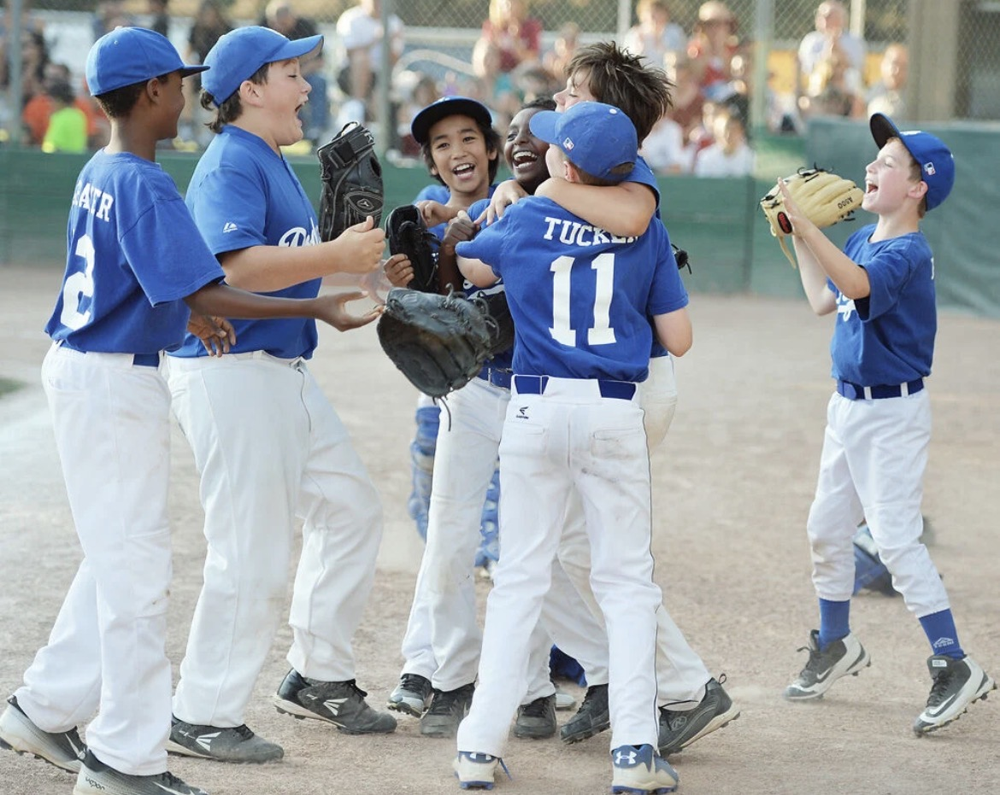
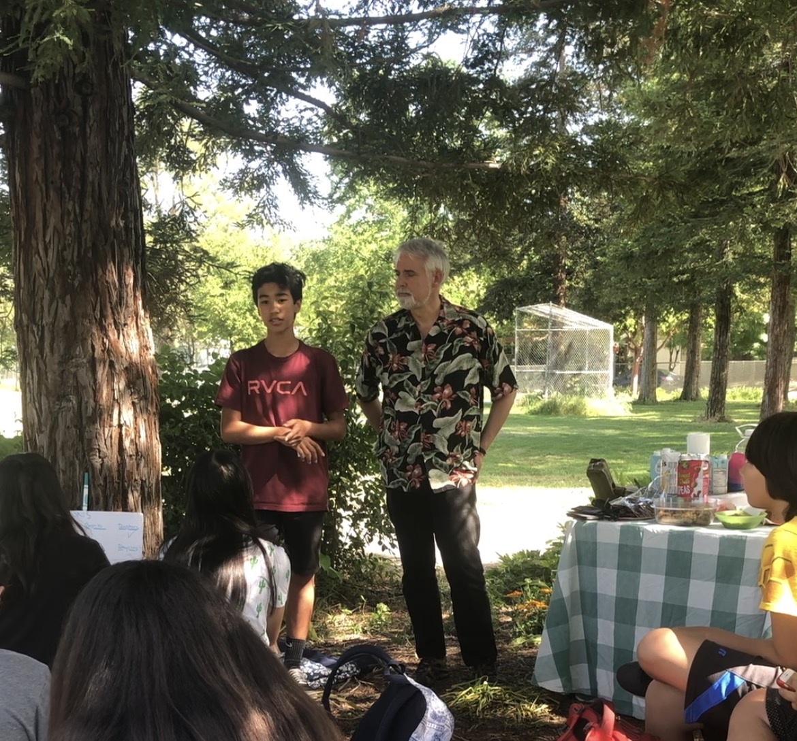
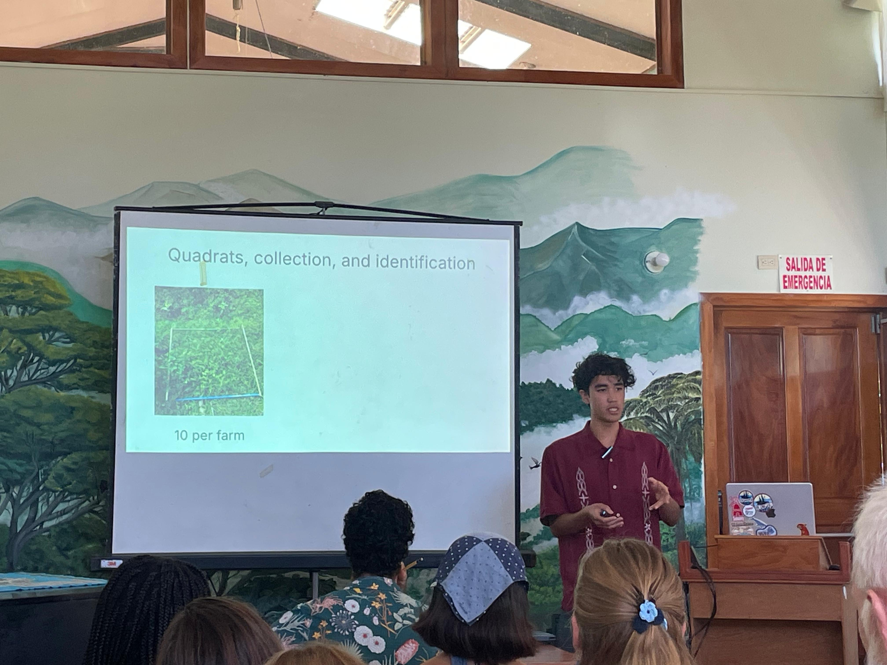

 
I grew up in Davis, California with my parents, sister, and maternal grandmother for a good part of my childhood. Growing up in Davis fostered a care for our planet and to consider the needs of people beyond myself. 

Some of the major activities I engage with in my hometown were baseball, tennis, and playing the piano. Although I was reluctant to learn piano in my early years, it is now a skill I greatly appreciate.\newline

### My environmental origin story

 

The beginnings of my environmentalist journey showed my good intentions, but impractical solutions in retrospect. After a presentation on the drought that California was in, I took it to heart, and started taking in less water. This was because drinking water was one of the more tangible uses of water that I experienced on a day to day basis. This led to a lot of headaches, which I realize now were not a cost of an effective water conservation strategy. 

Since then, I have learned about more effective strategies for water use reduction such as shorter showers in my own life, or for a societal scale, agricultural water use, and thermoelectric water use.\newline

### My future plans 

 

At the beginning of college, figuring out what I wanted to do for work after college felt like fishing in the ocean. Now it is a bit better, with the body of water the size of a lake. What is certain is that I would like to work right after college to get a feel for what I really want to do, before considering returning to grad school. 

I am open to doing any environmental work that has a positive impact but some areas of particular interest are habitat restoration, performing field impact analysis on the environment in consulting, water resources management, and sustainable agriculture. 
