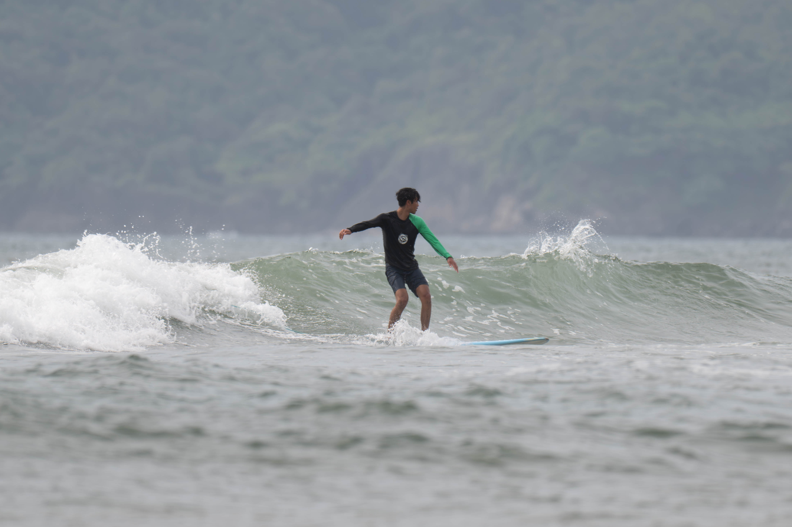
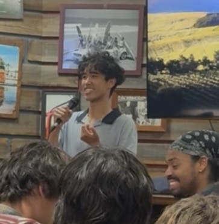
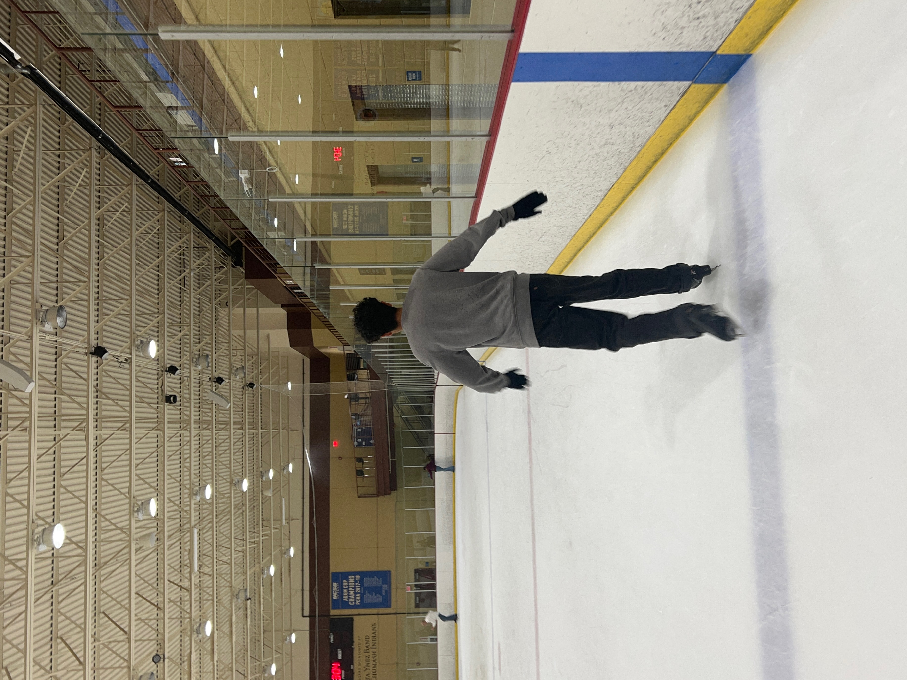

While some of my interests intersect with our natural world, I have many other hobbies that I try to fit into my life when I have the time. 

{width="80%"}

### Surfing
I started surfing regularly in college and have fallen in love with the feeling of riding a wave. Surfing has been a great way for me to connect with the ocean, and take a break from my work. After all, you can't bring your laptop out in the water! My favorite spots to surf around UCSB are Deveroux Point and Sands Beach. As a current longboarder I enjoy the slow rolling waves of Deveroux. Sands Beach isn't always sandy despite the name, and can get pretty gnarly during the winter due to the larger swells and rocky bottoms. During the summer however, the swell mellows out and sand is returned to the bottom so it's a fun place to catch lots of beach break waves with my friends. 

{width="80%"}

### Stand-Up Comedy
I have recently started performing stand-up comedy sets at open mics after having enjoyed watching shows for two years. Stand-up has brought a lot of joy to my life and I hope I can share it with other people through my performances. It has definitely challenged me to improve my public speaking skills beyond what is expected in a classroom. This includes proper timing talking in a dynamic voice, and putting myself in the vulnerable position of performing with people expecting me to be funny. 

{width="80%"}

### Video Games
I enjoy immersing myself in video games from time to time. Some of my favorite games are: The Outer Worlds, Skyrim, Sunset Overdrive, and playing Call of Duty Zombies with my friends. 

{width="80%"}

### Trying Out New Things
The photo above is not to show off any spectacular aptitude for ice skating but rather to provide an example of something I was trying for the first time. There is soo much to experience and learn in this world that I think it is limiting to put yourself into a box of what you do. 

Some things I have been trying out include rock climbing, oragami, sketching with pen, and yoga. 

